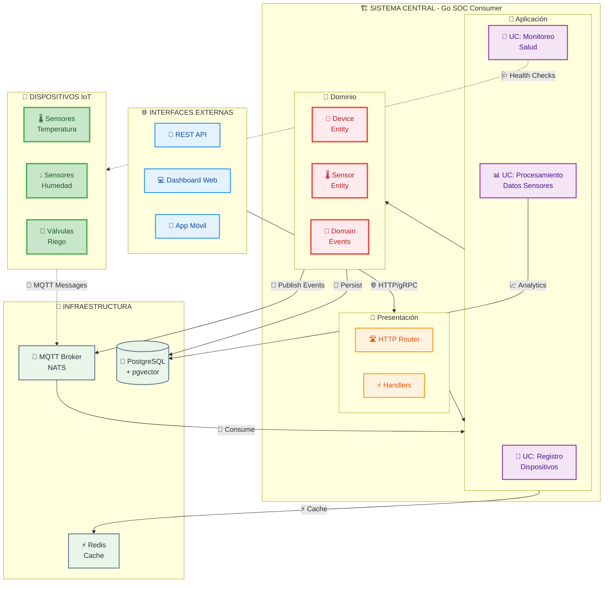

# 🌱 Sistema IoT de Riego Inteligente

<div align="center">
  
[](http://liwaisi.tech/about)
[](https://github.com/liwaisi-tech)
[](https://golang.org)
[](LICENSE)

*Un sistema completo de riego inteligente basado en IoT para optimizar el uso del agua en la agricultura*

</div>

## 📋 Tabla de Contenidos

- [Acerca del Proyecto](#-acerca-del-proyecto)
- [Características](#-características)
- [Arquitectura](#-arquitectura)
- [Tecnologías](#-tecnologías)
- [Instalación](#-instalación)
- [Uso](#-uso)
- [Estructura del Proyecto](#-estructura-del-proyecto)
- [Desarrollo](#-desarrollo)
- [Contribución](#-contribución)
- [Licencia](#-licencia)
- [Contacto](#-contacto)

## 🌟 Acerca del Proyecto

El **Sistema IoT de Riego Inteligente** es una solución integral desarrollada por [Liwaisi Tech](http://liwaisi.tech/about) para modernizar y optimizar los sistemas de riego agrícola. Este proyecto forma parte de la misión de Liwaisi Tech de democratizar la educación tecnológica en las zonas rurales de Colombia, proporcionando herramientas digitales de alto impacto para las comunidades agrícolas.

### Misión
Empoderar a las comunidades rurales a través de tecnología IoT accesible que optimice el uso del agua y mejore la productividad agrícola.

## ✨ Características

- 🌡️ **Monitoreo en Tiempo Real**: Sensores de temperatura y humedad
- 📱 **Comunicación IoT**: Integración MQTT para dispositivos IoT
- 🗄️ **Gestión Robusta de Datos**: Base de datos PostgreSQL con replicación
- 🔄 **Arquitectura de Eventos**: Mensajería NATS para comunicación asíncrona
- 🏗️ **Arquitectura Hexagonal**: Diseño modular y escalable
- 🐳 **Contenerización**: Despliegue con Docker y Docker Compose
- 📊 **Logging Estructurado**: Sistema de logs avanzado con Zap
- 🧪 **Testing Completo**: Cobertura de pruebas con mocks generados
- 🔐 **Seguridad**: Autenticación y validación de dispositivos
- ⚡ **Alto Rendimiento**: Optimizado para manejo de múltiples dispositivos

## 🏗️ Arquitectura

El sistema sigue el patrón de **Arquitectura Hexagonal** (Puertos y Adaptadores):



### Componentes Principales

- **Go SOC Consumer**: Servicio principal en Go que consume mensajes IoT
- **NATS Server**: Sistema de mensajería para comunicación entre servicios
- **PostgreSQL**: Base de datos principal con soporte para vectores (pgvector)
- **PgBouncer**: Pool de conexiones para PostgreSQL
- **MQTT Broker**: Comunicación con dispositivos IoT

## 🛠️ Tecnologías

### Backend
- **Lenguaje**: Go 1.23+
- **Framework Web**: HTTP nativo con middleware personalizado
- **ORM**: GORM con driver PostgreSQL
- **Mensajería**: NATS, MQTT (Paho)
- **Logging**: Zap (logging estructurado)
- **Testing**: Testify con mocks generados
- **Validación**: Validadores personalizados

### Infraestructura
- **Base de Datos**: PostgreSQL 15 con pgvector
- **Mensajería**: NATS 2.10 con soporte MQTT
- **Contenerización**: Docker & Docker Compose
- **Pool de Conexiones**: PgBouncer

### Herramientas de Desarrollo
- **Linter**: golangci-lint
- **Generación de Mocks**: testify/mock
- **Gestión de Dependencias**: Go Modules
- **Automatización**: Makefile

## 🚀 Instalación

### Prerrequisitos

- [Go](https://golang.org/doc/install) 1.23 o superior
- [Docker](https://www.docker.com/get-started) y [Docker Compose](https://docs.docker.com/compose/install/)
- [Make](https://www.gnu.org/software/make/) para comandos automatizados

### Instalación Rápida

1. **Clonar el repositorio**
   ```bash
   git clone https://github.com/liwaisi-tech/iot-server-smart-irrigation.git
   cd iot-server-smart-irrigation
   ```

2. **Configurar variables de entorno**
   ```bash
   cd backend/go-soc-consumer
   cp .env.example .env
   # Editar .env con tus configuraciones
   ```

3. **Instalar dependencias**
   ```bash
   go mod tidy
   ```

4. **Iniciar servicios de infraestructura**
   ```bash
   # Desde la raíz del proyecto
   docker-compose up -d postgres nats
   ```

5. **Ejecutar el servicio**
   ```bash
   cd backend/go-soc-consumer
   make run
   ```

## 🎯 Uso

### Comandos de Desarrollo

```bash
# Navegar al servicio principal
cd backend/go-soc-consumer

# Construir la aplicación
make build

# Ejecutar localmente
make run

# Ejecutar tests con cobertura
make test

# Análisis de código estático
make check-linter

# Limpiar artefactos
make clean

# Ver información del entorno
make dev-info
```

### Comandos Docker

```bash
# Iniciar todos los servicios
docker-compose up -d

# Iniciar servicios específicos
docker-compose up -d postgres nats

# Ver logs
docker-compose logs -f go-soc-consumer

# Parar servicios
docker-compose down
```

### Endpoints de la API

- **Health Check**: `GET http://localhost:8080/health`
- **Ping**: `GET http://localhost:8080/ping`

### Configuración MQTT

Los dispositivos deben publicar mensajes de registro en el tópico:
`/liwaisi/iot/smart-irrigation/device/registration`

**Formato del mensaje**:
```json
{
  "mac_address": "AA:BB:CC:DD:EE:FF",
  "device_name": "Sensor Nodo 1",
  "ip_address": "192.168.1.100",
  "location_description": "Zona de Cultivo A"
}
```

### Puertos de Servicios

- **HTTP Server**: `localhost:8080`
- **PostgreSQL**: `localhost:5432` (directo) / `localhost:6432` (PgBouncer)
- **NATS**: `localhost:4222` (NATS) / `localhost:1883` (MQTT)
- **NATS Monitoring**: `localhost:8222` (interfaz web)

## 📁 Estructura del Proyecto

```
iot-server-smart-irrigation/
├── 📁 backend/
│   └── 📁 go-soc-consumer/           # Servicio principal en Go
│       ├── 📁 cmd/server/            # Punto de entrada
│       ├── 📁 internal/              # Código privado de la aplicación
│       │   ├── 📁 app/              # Lógica de aplicación
│       │   ├── 📁 domain/           # Entidades y reglas de negocio
│       │   ├── 📁 infrastructure/   # Adaptadores externos
│       │   ├── 📁 presentation/     # Capa de presentación
│       │   └── 📁 usecases/         # Casos de uso
│       ├── 📁 pkg/                  # Código público reutilizable
│       ├── 📁 mocks/                # Mocks generados para testing
│       └── 📄 Makefile              # Comandos de automatización
├── 📁 front/                        # Frontend (en desarrollo)
├── 📁 docs/                         # Documentación
├── 📁 infrastructure/               # Configuraciones de infraestructura
│   └── 📁 nats/                    # Configuración NATS
├── 📁 scripts/                      # Scripts de utilidad
├── 📄 docker-compose.yml            # Orquestación de servicios
├── 📄 CLAUDE.md                     # Guía para Claude Code
└── 📄 README.md                     # Este archivo
```

## 🔧 Desarrollo

### Flujo de Desarrollo Recomendado

1. **Configurar entorno**
   ```bash
   # Iniciar infraestructura
   docker-compose up -d postgres nats
   
   # Navegar al backend
   cd backend/go-soc-consumer
   
   # Instalar dependencias
   go mod tidy
   ```

2. **Ejecutar tests**
   ```bash
   make test
   ```

3. **Verificar calidad de código**
   ```bash
   make check-linter
   ```

4. **Desarrollar funcionalidad**
   ```bash
   make run
   ```

### Estándares de Código

- Seguir las convenciones de Go
- Mantener cobertura de pruebas alta
- Usar el sistema de logging estructurado existente
- Seguir los patrones de manejo de errores del dominio
- Documentar funciones públicas

### Testing

- **Tests unitarios**: Todos los casos de uso y entidades
- **Tests de integración**: Repositorios con base de datos real
- **Mocks**: Generados automáticamente para interfaces
- **Cobertura**: Reporte generado en `coverage.out`

### Variables de Entorno

Crear archivo `.env` en `backend/go-soc-consumer/`:

```env
# Base de datos
DB_HOST=localhost
DB_PORT=5432
DB_USER=liwaisi-sis-admin
DB_PASSWORD=tu_password
DB_NAME=smart-irrigation-system-db
DB_SSL_MODE=disable

# MQTT
MQTT_BROKER_URL=tcp://localhost:1883

# NATS
NATS_URL=nats://localhost:4222

# Logging
LOG_LEVEL=info
LOG_FORMAT=json
ENVIRONMENT=development
```

## 🤝 Contribución

¡Las contribuciones son bienvenidas! Especialmente de desarrolladores latinoamericanos interesados en IoT y agricultura.

### Cómo Contribuir

1. **Fork** el proyecto
2. **Crea** una rama para tu funcionalidad (`git checkout -b feat/nueva-funcionalidad`)
3. **Commit** tus cambios (`git commit -m 'feat: agregar nueva funcionalidad'`)
4. **Push** a la rama (`git push origin feat/nueva-funcionalidad`)
5. **Abre** un Pull Request

### Convenciones de Commits

Usamos [Conventional Commits](https://www.conventionalcommits.org/):

- `feat:` Nueva funcionalidad
- `fix:` Corrección de bugs
- `docs:` Cambios en documentación
- `test:` Agregar o modificar tests
- `refactor:` Refactorización sin cambios funcionales
- `chore:` Tareas de mantenimiento

### Issues y Solicitudes

- Reporta bugs usando [GitHub Issues](https://github.com/liwaisi-tech/iot-server-smart-irrigation/issues)
- Propón nuevas funcionalidades
- Mejora la documentación
- Comparte casos de uso reales

## 📄 Licencia

Este proyecto está licenciado bajo la Licencia Apache 2.0. Ver el archivo [LICENSE](LICENSE) para más detalles.

## 📞 Contacto

### Equipo Liwaisi Tech

- **Sitio Web**: [liwaisi.tech](http://liwaisi.tech/about)
- **GitHub**: [@liwaisi-tech](https://github.com/liwaisi-tech)
- **Fundadores**:
  - **Briggitte Castañeda** - Ingeniera Electrónica
  - **Braejan Arias** - Ingeniero de Software

### Proyecto

- **Repository**: [iot-server-smart-irrigation](https://github.com/liwaisi-tech/iot-server-smart-irrigation)
- **Issues**: [Reportar Problema](https://github.com/liwaisi-tech/iot-server-smart-irrigation/issues)
- **Discussions**: [Discusiones del Proyecto](https://github.com/liwaisi-tech/iot-server-smart-irrigation/discussions)

---

<div align="center">

**Desarrollado con ❤️ por [Liwaisi Tech](http://liwaisi.tech/about)**

*Democratizando la tecnología en las zonas rurales de Colombia*

[](http://liwaisi.tech/about)

</div>